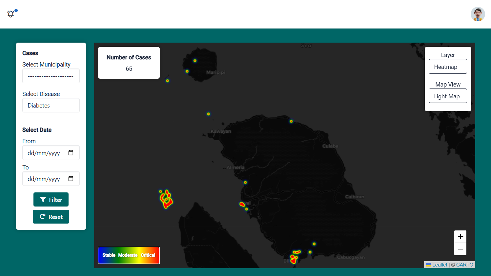

# Heat Mapping of Various Health Cases in Biliran Province

A web-based GIS for monitoring disease patterns in Biliran Province. Built with Leaflet.js, PHP, and MySQL — renders health case data as interactive heatmaps and choropleth maps with a threshold-based alert system.



## Features

- **Heat Map Layer** — Weighted heatmap overlay showing disease density across the province.
- **Choropleth Map** — Color-coded barangay-level visualization based on case counts.
- **Threshold-Based Alerts** — Flags barangays/municipalities when weekly cases exceed a defined threshold (default: 10 cases/week).
- **Multi-Case Tracking** — Supports 5 disease types (Diabetes, Pneumonia, Tuberculosis, HFMD, Monkeypox) with architecture designed to accommodate more.
- **Dual User Roles** — Admin panel for province-level management; Municipality User panel for local data entry.

## Tech Stack

- **Frontend:** Leaflet.js, Leaflet-heat, ApexCharts, Bootstrap, jQuery
- **Backend:** PHP (PDO)
- **Database:** MySQL (`health_cases`)
- **Maps:** GeoJSON boundary data for municipalities and barangays

## Project Structure

```
├── admin/                    # Admin panel (province-level)
│   ├── index.php             # Dashboard
│   ├── chloropleth_map.php   # Choropleth map view
│   ├── statistics.php        # Statistics and charts
│   ├── disease_data.php      # Patient case data
│   ├── barangays.php         # Barangay management
│   ├── municipalities.php    # Municipality management
│   ├── diseases.php          # Disease type management
│   ├── residents.php         # Resident records
│   └── ...
├── municipality_user/        # Municipality-level user panel
│   ├── index.php             # Dashboard
│   ├── add_patient.php       # Add patient cases
│   ├── barangays.php         # Barangay management
│   ├── statistics.php        # Statistics
│   └── ...
├── assets/
│   ├── css/                  # Stylesheets
│   ├── js/                   # JavaScript (dashboard, sidebar)
│   ├── json/                 # GeoJSON & municipality/barangay data
│   ├── leaflet/              # Leaflet library files
│   ├── libs/                 # Third-party libs (Bootstrap, etc.)
│   └── images/               # Uploads, profile images, preview.png
├── vendor/                   # Composer dependencies (TCPDF)
├── conn.php                  # Database connection (gitignored)
├── function.php              # Core application logic (Functions class)
├── navigate.php              # Request routing/handler
├── session.php               # Session management
├── login.php                 # Login page
└── logout.php                # Logout handler
```

## Setup

### Prerequisites

- PHP 8.0+
- MySQL 5.7+
- Composer
- Web server (Apache/Nginx)

### Installation

1. **Clone the repository**

```bash
git clone <repo-url>
cd heat-mapping-of-various-health-cases-in-biliran-province
```

2. **Install dependencies**

```bash
composer install
```

3. **Database setup**

Create a MySQL database named `health_cases` and import the schema (tables: `admin`, `municipality_users`, `patients`, `diseases`, `cases`, `barangays`, `municipalities`, `residents`).

4. **Configure database connection**

Copy `conn.example.php` to `conn.php` and update credentials:

```php
private $hostdb = "localhost";
private $userdb = "root";
private $passdb = "";
private $namedb = "health_cases";
```

5. **Serve the application**

Using Laragon, access directly at:

```
http://heat-mapping-of-various-health-cases-in-biliran-province.test
```

6. **Login URLs**

- Admin: `/admin/admin_login.php`
- Municipality User: `/municipality_user/municipality_user_login.php`

## Notes

Alert threshold is hardcoded at **10 cases/week** across all disease types. Future development should implement per-disease adaptive thresholds based on historical baselines and population density.

## License

MIT — see [LICENSE](LICENSE).